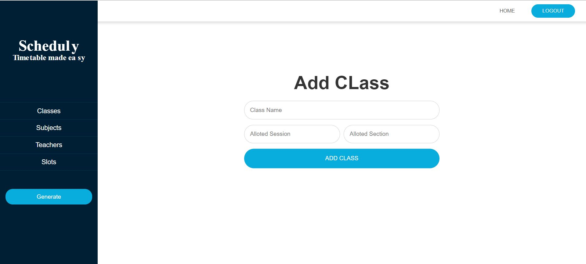
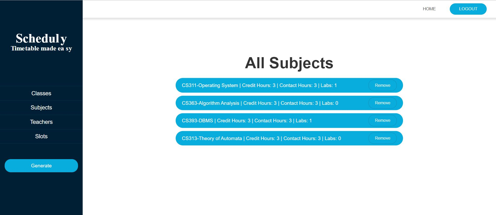

# <b>Activity Scheduling Tool</b>

## <b>Executive Summary</b>

The purpose of the project is to find an optimal solution to the time
tabling problem which is one of the highly constrained N-P hard
problems. The need of this sort of a time tabling software arised as
manually designing a time table takes too much time and effort and
if overlap occurs among the timetable, the timetable is redesigned
using hit and error methods which has very high time cost. So, in
this project we are trying to develop such a software which will
automatically and will decrease the effort and time required for the
generation of a time table in accordance to the given input. The
expected main input is about teachers, classes and subject’s data
along with the maximum workload of a teacher in a week to generate
a valid time-table. The main constraints that this software should
satisfy are that a teacher should not have a lecture in more than one
class at the same time slot and a class should not have more than one
lecture in a given time slot. The solution which we will get from this
project should have to satisfy the above-mentioned constraints.
The platform we used to develop this software is web application.
The programming language used to implement this software is
JavaScript. In the development of the UI, React.js is used while
backend is implemented using node.js. To make it a multi user app
login facility is provided and to store the data corresponding to the
user, mongodb database is used locally. Project is currently run on
local severs but we have planned it to deploy it using Heroku and
we will also change the database from local to mongodb atlas. 

This projected is completed in 5 phases. 

- <b>Phase 1</b> 
  We have designed our algorithm for this problem by
  analyzing the problem deeply and designed the UI for the
  project.
- <b>Phase 2</b> 
  In the second step our project we worked to improve the
  efficiency of our algorithm and calculated the time
  complexity of it. We also proved the correctness of our
  algorithm.
- <b>Phase 3</b> 
  In this phase we implemented the algorithm on the backend
  and get the desired results by providing our dummy inputs.
- <b>Phase 4</b> 
  Backend was implemented and Rest API’s were developed
  to interact with database and frontend.
- <b>Phase 5</b> 
  Frontend was developed and iteration of backend with our
  UI is done in this step.

## <b>Business Case</b>

### <b>Business need for the project</b>

Designing of timetables is one of the most complicated problem. Designing a time table for a school or department in most of the
institutions are still done by hand which has many drawbacks. Manual designing of time table takes too much time and is a difficult
task. If the time table is to be generated for a bigger faculty, the optimal solution may contain clashes and to resolve these clashes a
teacher may need to compromise on his schedule. So there arises a requirement of a software which should automatically generate the time table without any clashes.

### <b>End user of the product</b>

In this project our intended audience is all the educational
institutions. These institutions are schools, colleges and universities.
Our main target in this project is the administration of our
university.

### <b>Motivation for Project</b>

As our faculty faces a stern task of designing the time table for each
section in every new semester, we decided to provide them with an
application which will generate an automated timetable which will
ease off the burden of designing a time table by hand. Moreover, by
choosing this project we were set to have exposure of how the
projects are managed in industry as milestones and workflows were
purely designed in accordance to the requirements of industry.

### <b>Description of the project objective(s)</b>

One of the main objectives of this project is to develop an algorithm
of lowest running cost which will generate a time table automatically
and to integrate that algorithm with some sort of graphical user
interface. The other main and important objective is to develop a full
stack web application where a database should be used to make it a
multi user application. Login and sign up facility should be provided
for users to make a secure and permanent storage system. User
authentication is also implemented. In this application our objective
is to store all the records entered by the user and to show them on the
UI.

### <b>Level of impact expected should the project proceed and implications of not proceeding</b>

This project is open sourced which means that there is no cost
whatsoever in using this project assuming that user have access to
internet and local machine to run this software. Use of such projects
in educational institutions should be encouraged considering that its
economical, efficient and the biggest advantages of reduced
workload of faulty in designing the software manually.

### <b>Functional Requirements</b>

The main requirement of this project is to generate a timetable which
should be clash free. The functional requirements of this project are
further divided into user and admin requirements.

1. Admin Requirements
   - The software should handle new users i.e. save the
     credentials of new user successfully.
   - Input should be validated.
   - Whenever a new record is inserted, it should be shown
     in the view records.
   - Login should be authenticated. User with false
     information should not be allowed to log into the
     system.
   - Responsive UI for all the platforms i.e. laptop,
     mobile.
   - Show error on UI if a user violates any of validation
   - Responsive buttons.
   - Get the previously saved data of a user.
   - Display the generated time table in tables on UI.
2. User Requirements
   - User provide email and his information to register into
     the system.
   - User should provide details about subjects, teachers
     and classes.

## <b>Benefits</b>

- <b>Academic Benefits</b> 
  After successful implementation of this project, we are able to
  have a fair share of grip in developing algorithms for the realworld problems. It was excellent experience of working in
  phases and meeting all the deadlines and this brought a great
  exposure of managing such complex projects. As algorithm
  analysis is a key subject in the field of computer science, we
  are able to understand it far better after doing this project.
  Moreover, we have a great experience and learning as we have
  developed a full stack application first time.
- <b>Industrial Benefits</b> 
  It will reduce the errors that are expected in the manual time
  table. It will reduce the efforts of the human hands that is
  required to handle these errors and to use each slot. It assures
  the optimal solution which satisfies all the given constraints.
  As this application is open sourced so it decreases the costs at
  industrial level as some institutions tend to use all online time
  table generating software which are paid.

## <b>Implementation Details</b> 

### <b>Total Number of commits</b>

230

### <b>Exact contribution of each member</b>

There is no such distribution of work among the group members. Both
group members mutually completed each milestone by mutually
working on it. Both the group members lead the way in completing
the milestones according to the respective skill sets i.e. in analysis and
correctness of algorithm, pseudo code writing and report writing
2018-CS-31 lead the way and put bit more effort then the other group
member. Similarly, 2018-CS-32, lead the way while developing the
UI as he has superior skill set in that respective field and solely
managed the state integration in the UI and handling of http requests.
Designing of the REST API’s and Models for the database was
designed by both of the group members. 2018-CS-31 lead the way
while implementing the algorithm on the backend.

### <b>Commits in GitHub repository by each member</b>

| Sr. No. |               Registration Number                | Commits |
| :------ | :----------------------------------------------: | :-----: |
| 1.      | [2018-CS-31](https://github.com/ghulamghousdev)  |   112   |
| 2.      | [2018-CS-32](https://github.com/ahmadzaheer-dev) |   119   |

### <b>Algorithm</b>

We took help from multiple forums and used their inputs on this
problem. We found a source where some part of algorithm is
provided, we took it and further enhanced the functionality of that
algorithm. First it was used to generate the time table only for one
section but after modification it is now able to generate multiple time
table for multiple sections.

### <b>Formats of input</b>

Input attributes which are required for this project are subjects,
teachers, class names and slots. Moreover, to use this project, a user
credentials are also required to sign up into the system. The input
format for user input is described in the below paragraph.
We are taking input separately for each attribute i.e. for subjects,
classes, teachers and slots.

1. Sign up

- First Name = text
- Second Name = text
- Email = text
- Password = text

2. Login

- Email = text
- Password = text

3. Subjects

- Subject ID = text
- Subject Name = text
- Credit Hours = number
- Contact ours = number
- Labs = number

4. Classes

- Class Name =text
- Session = text
- Section = text

5. Teachers

- First Name =text
- Second Name = text
- Reg Number = text
- working hours = number

6. Slots

- Teacher Name = text
- Subject Name = text
- Section = text
- Session = text
- Lectures = number

### <b>Validations</b>

Following validations are used on input.

- Subject Name, Teacher Name should be strings.
- Validation on format of email is also implemented.
- Password should have min length 5 and max 15.
- Credit should not be greater than 3 and not less than 0
- Contact Hours should not be greater than 3 and less than 0.
- Subject Code and Reg Number of teachers should be unique.
- Working Hours should not be less than 0.
- Credit Hours, contact hours, working hours and labs should be
  numeric values.
- Password and Confirm password should be same

### <b>Format of output</b>

After the execution of algorithm on the provided input, our algorithm
will return an array that will further contain the nested arrays for each
class. In each nested array for class, there will be arrays equal to
number of working days. We will show the time table on UI in the
form of tables. Each table will represent time table of one class. Each
row will represent a working day and each slot will represent a time
slot. In each cell we will show the assigned teacher name and assigned
subject name.

### <b>Deployment</b>

We have not deployed the project yet but we plan to deploy it on
Heroku.

## <b>Interfaces for your project</b>

1. Welcome Page 
   The welcome page has two controls which are signup and login. If someone is using this software
   for the very first time, he needs to register and signup button will open a window where he can
   register him or her. But if user has already registered himself/herself or used this software before,
   he simply needs to click on the login button which will lead him/her to a window where he/she
   need to put the credentials.

   - Sign up: A user should use this to register himself/herself.
   - Login: A user should use this to login in to system.

   

2. Sign up 
   Whenever a new user wants to use this system, he must register. Sign up page consists of 5
   input boxes and a submit button.

- Login: To log in to the application.
- Sign up: To register to use this software.
- First Name: A user should fill this input box by providing his/her first name.
- Last Name: A user should fill this input box by providing his/her last name.
- Email Address: A user should fill this input box by providing his/her email.
- Password: A user should fill this input box by providing a strong password. This
  password will be re required when user wants to login into the application.
- Confirm Password: A user should fill this input box by re writing his/her password.
- Sign Up Button (Right below input boxes): This button is used to submit the credentials.

  

3. Log In 
   This page consists of two input boxes and a login button. If the credentials are correct, you will
   be led to dashboard.

- Email Box: A user should be required to fill this input box with a valid email which he
  used to register him/her self.
- Password: User should enter his password in this box.
- Login button: By clicking on this button user will be directed to the dashboard if the
  credentials are turned out to be true.

  

4. Dashboard 
   This page will be shown after a user successfully login to the application. It consists of a header
   and a navigation panel.
   In header

- Home Button: This will lead to the dashboard whenever someone presses it.
- Logout Button: This will log out a user from the application and takes him/her to welcome
  screen.
  In navigation panel, there are 5 buttons which are described below.
- Classes: It has a sub menu which shows Add and All Classes Button. By clicking the Add
  button, a new page will be opened where user can add a new class. By clicking on the All
  Classes button, all the classes will be shown on the UI.
- Subjects: It has a sub menu which shows Add and All Subjects Button. By clicking the
  add button, a new page will be opened where user can add a new subject. By clicking on
  the All Subjects button, all the subjects will be shown on the UI.
- Teachers: It has a sub menu which shows Add and All Teachers Button. By clicking the
  add button, a new page will be opened where you can a new teacher. By clicking on the
  All Teachers button, all the teachers will be shown on the UI.
- Slots: It has a sub menu which shows Add and All Slots Button. By clicking the Add
  button, a new page will be opened where you can add a new slot. By clicking on the All
  Slots button, all the slots will be shown on the UI.
- Generate: This button will send a request to the backend to run algorithm and will show
  the returned output.

  

5. Add Class 
   To add a new class, you need to click on classes in navigation panel and select add from
   sub menu. On this page user will be able to add a new class. It has 3 input fields and a
   submission button.

- Class Name: User need to add a class name such as N-7, N-4.
- Session: This input field requires a session name such as 2018, 2020.
- Section: User need to enter the section of the class.
- Add Class Button: This button will save the records.

  

6. View All Classes 
   This will show all the classes added by a user. You can go to this page by clicking on classes in
   navigation panel and select all classes from sub menu. It has only one button Remove which
   will remove a class.

   

7. Add Subject 
   To add a new subject, you need to click on click on subjects in navigation panel and select add
   from sub menu. On this page user will be able to add a new Subject. It has 5 input fields and a
   add button.

- Subject Name: This will be the name of subject to be added such as Operating System
  etc.
- Subject Code: This will be the code of subject to be added such as CS311 etc.
- Credit Hours: This will be the credit hours of a subject and it cannot be greater than 3.
- Contact Hours: This will be the contact hours of a subject and it cannot be greater than
  credit hours.
- Labs: Number of labs assigned to a subject.
- Add Subject Button: This button will save the records.

  

8. View All Subjects 
   This will show all the subjects added by a user. You can go to this page by clicking on subjects
   in navigation panel on left and select all subjects from sub menu. It has only one button Remove
   which will remove a subject.

   

9) Add Teacher 
   To add a new teacher, you need to click on click on teachers in navigation panel and select add
   from sub menu. On this page user will be able to add a new teacher. It has 4 input fields and a add
   button.

- First Name: This will be the first name of teacher to be added such as Samyan.
- Last Name: This will be the last name of teacher to be added such as Qayyum.
- Subject Code: This will be the code of subject to be added such as CS311 etc.
- Reg Number: This will be the Reg Number of a teacher and it cannot be greater than
  duplicated.
- Working Hours: This will be the working hours of a teacher in a week.
- Add Teacher Button: This button will save the records.

  

10. View All Teachers 
    This will show all the teachers added by a user. You can go to this page by clicking on teachers
    in navigation panel on left and select all teachers from sub menu. It has only one button named
    as Remove which will remove a teacher.

    

11. Add Slots 
    To add a new subject, you need to click on click on subjects in navigation panel and select add
    from sub menu. On this page user will be able to add a new Subject. It has 5 input fields and a
    add button.

- Teacher Name: This will be the name of teacher to be assigned to a subject.
- Subject Name: This will be the name of subject to be assigned to the above teacher.
- Session: This input field will be the session name of the class such as 2018, 2020.
- Section: This input field will be the section of the class to which the teacher is being
  assigned.
- Add Slots Button: This button will save the records.

  

12. View All Slots 
    This will show all the slots added by a user. You can go to this page by clicking on slots in
    navigation panel on left and select all slots from sub menu. It has only one button named as
    Remove which will remove an instance of a slot.

    

13. Timetable 
    By clicking on the Generate Button from navigation panel on left, you will see the generated time
    table. Our output will be shown in tables on this page. Each table will represent time table of one
    class. Each row will represent a working day and each slot will represent a time slot. In each cell
    we will show the assigned teacher name and assigned subject name.

    

## <b>Integration</b>

As such we have not faced any difficulty while integrating the UI with our algorithm on backend. We
simply first implemented our algorithm on the backend. Then we designed our frontend without any
connections with the backend. After completing the UI, we designed REST API’s to handle
communicate between UI and our backend. To execute algorithm, we are required to retrieve data from
the database, for this purpose we also used a REST API. Using REST API’s made it easier for us to
handle the data manipulation. Our strategy was to use a REST API which will handle http requests from
the UI and will send a response back to UI. Whenever a request is made from the UI using a REST API,
the corresponding action to request is performed i.e. the request can be for to save new data, delete some
specific record or to generate time table. If the request is to add new data into the database, a post request
will be sent to the server which will save the instance using a model (model is already defined on the
backend) into the database corresponding to the user ID. If the data is saved is successfully, a response
will be sent to the UI. Similarly, for deletion of a record, a delete request will be sent to the server running
on backend and data will be removed from database and response will be sent to the UI showing that
operation is executed successfully. When a user makes get request to generate a time table, find function
will be executed in the API and data will be retrieved from the database and passed to algorithm. The
algorithm will return an array of objects which will be sent to the UI. So, all of these requests are handled
using an express server on backend and REST API is used to communicate between frontend server and
backend server.

## <b>Technology</b>

React.js for frontend.
Node.js for backend.
MongoDB as a local database.

## <b>Platform</b>

Web Application
