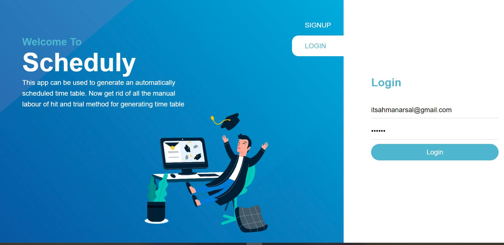
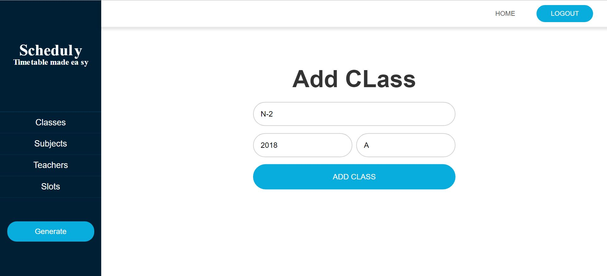
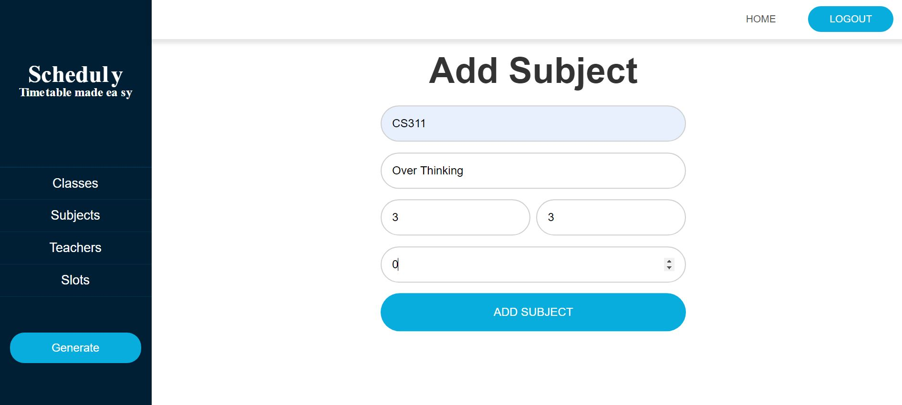
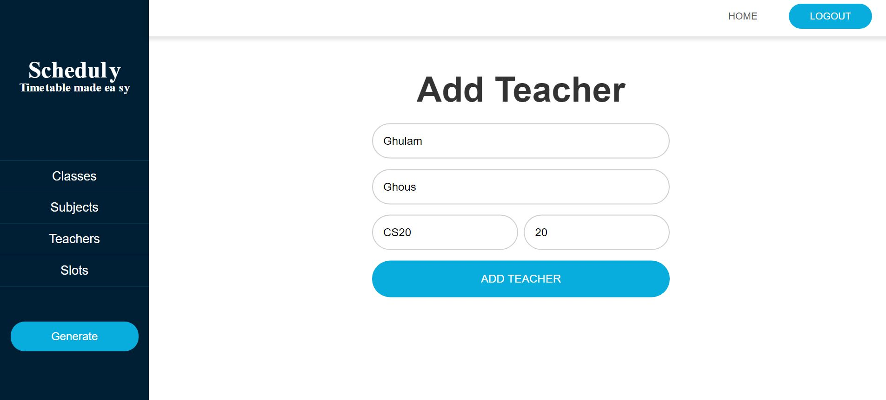
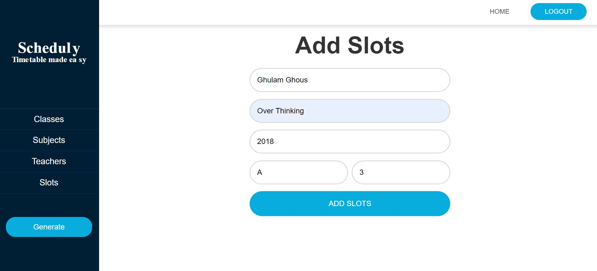
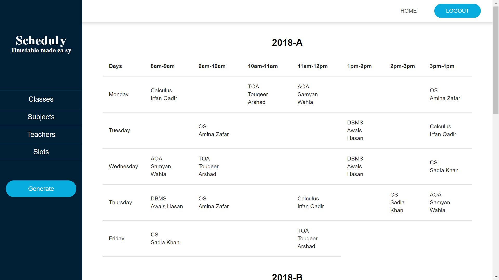

# User Manual

To use this project, a user should follow the following steps to gain the desired results.

## Sign up

If someone is using this application for the very first time, he/she needs to register themselves first. On welcome screen there's a sign up button user, user should click it to go to the sign up page. In first input field user need to enter his first name. In the second input field user need to enter his last name. In the third input field user need to input a valid and active email address. In the last two input fields, enter a strong password which should not be less then 8 characters and it should be matching.

Let's assume we have a new user. The input fields for the user will be filled like.

## Login

In this step user need to click on the login button and then fill the input boxes with email and password user used to sign up.

Following screen shows how to fill it.

## Add Class

After logging in, user need to click on AddClass from left navigation panel to add a new class. This page contains 3 input fields. In first field enter the name of class and it can be any type of string. In second input field, enter the starting year of the batch i.e. 2018, 2020. Last input field is about section of the class.

For example:

## Add Subjects

After clicking on AddSubjects and user will be lead to screen where he can add a new subject. This page contains 5 input fields. First field is about subject code i.e. it can be any type of. Second input field is about subject name. User should enter the name of the subject. Credit hours,Contact hours and labs are integer values.

For example:

## Add Teachers

To go to add teachers page for adding a new teacher, user need to click on AddTeachers from left navigation panel. This page contains 4 input fields. In first field enter the first name of teacher, in second input field enter last name of teacher. In third input, enter reg number of teacher allocated by the university. Last input field is about working hours of a teacher. Mean how many hours a teacher is available.

For example:

## Add Slots

## Add Teachers

To go to add slot page, for adding a new slot, user need to click on Slots from left navigation panel. This page contains 6 input fields. In first field enter the name of teacher you want to assign the class, in second input field enter name of subject you need to assign a teacher. In third input, starting year of the batch. In the fourth input field, enter the section of the class. Last input field is about contact hours of the class.

For example:

After adding all of these records, user need to click on the generate table to get the time table. The time table will be shown in the form of table i.e.

